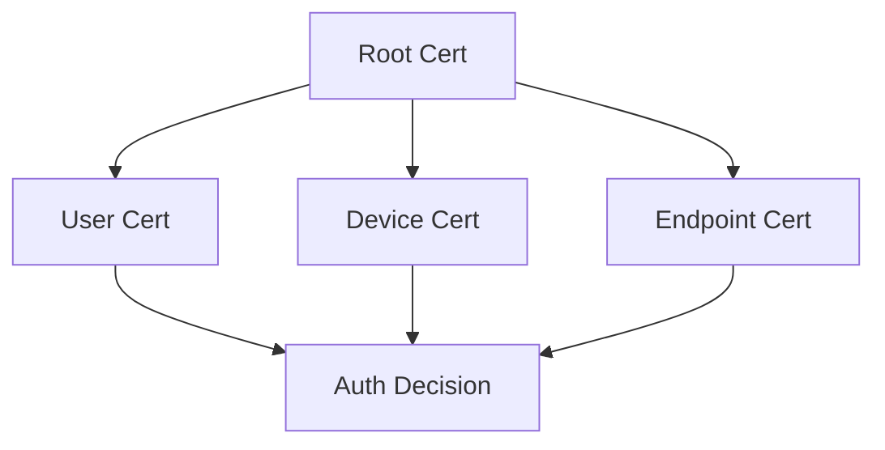

# 🔥 YouMatter Systems — White Paper

### Conicu Consulting Pty Ltd

*Redefining Patient Flow, Trust & Tech in Modern Healthcare*

---

## 🚀 Introduction – Why Another PAS?

Hospitals don’t run on beds and bandages alone — they run on **data, trust, and time**. Legacy Patient Administration Systems (PAS) burn all three. **YouMatter** flips the script: a cloud-native, **DAG-secured**, FHIR-fluent platform that turns admin overhead into patient time.

*Built by Conicu Consulting — veterans of Defence-grade security, IAM, and large-scale cloud.*

---

## 🎯 Mission

> **Zero admin drag. Max patient impact.**

We weaponise simplicity so clinicians can weaponise care.

**Our Purpose**
Deliver a resilient, user-centric PAS that lifts care standards while slicing operational waste.

**Our Commitments**

* **Nurses** – Quick charts, fewer clicks, more bedside time.
* **Doctors** – Instant context, seamless hand-offs, no data chase.
* **Hospitals** – Shorter queues, leaner ops, happier CFOs.

**Our Values**

* *Security First* – Defence DNA, zero-trust baked in.
* *Humans Over Screens* – UX from the classroom, not the server room.
* *Patient-Centricity* – Every feature maps to a better outcome.

**Vision**: Tech that disappears so healthcare can reappear.

---

## ⚡ Key Differentiators

1. **Human-Centric Interface**

   * *UX that feels like 2025, not 1995.*
   * Adaptive layouts for ward tablets, nurse stations, and mobile rounds.

2. **100 % Web-Native**

   * Device-agnostic; zero VDI creep.
   * Hosting bill slashed — one cluster, infinite sessions.

3. **Infinite Scale, Zero Stall**

   * Auto-scales across AWS/Azure/GCP or on-prem K8s.
   * Runs smooth on yesterday’s hardware, sprints on today’s.

4. **Defence-Grade Security**

   * AES-256, TLS 1.3, real-time anomaly scoring.
   * **UMETA ACT-DAG Trust Layer** — portable certs, passwordless access, live revocation.

5. **FHIR & HL7 Native**

   * Interop with Epic, Cerner, MedTech… or that decade-old lab system no one wants to touch.

6. **Future-Proof Core**

   * Modular micro-services = hot-swap new tech without downtime.
   * CI/CD pipeline with canary releases, blue/green, and chaos testing baked in.

---

### 🗺️ Trust Flow at a Glance



```bash
# Grant contextual access via DAG ACL
umatter trust grant --user alice \
                      --resource db.prod \
                      --signal auth.login \
                      --ttl 24h

# Export portable cert for passwordless SSO
umatter cert export --target win-user-store --format pkcs12
```

---

## 🔍 Feature Deep-Dive

| Domain             | What It Does                                                   | Why It Matters                                   |
| ------------------ | -------------------------------------------------------------- | ------------------------------------------------ |
| **Patient Flow**   | One-click admit, real-time bed map, discharge wizard           | Cuts ER bottlenecks & midnight paperwork         |
| **Analytics**      | Drag-n-drop dashboards, custom KPIs, AI-driven trend surfacing | Turns data sludge into exec-ready insight        |
| **Secure Docs**    | Encrypted blob store with smart tagging & role-aware search    | Bye-bye, paper chases & USB dramas               |
| **Extensible API** | REST/GraphQL + event bus                                       | Plug in wearables, BI tools, or tomorrow’s gizmo |

---

## 🛠️ Implementation Playbook

1. **Deploy** – Helm chart or Terraform module to your cloud/hybrid stack.
2. **Integrate** – Point-and-click connectors for AD/LDAP, FHIR feeds, and finance systems.
3. **Migrate** – Assisted ETL pipelines with rollback safety nets.
4. **Observe** – Prometheus/Grafana stack + SIEM hooks.
5. **Evolve** – Quarterly feature drops driven by clinician feedback loops.

---

## 🏁 Results & ROI

* **30 %** faster admissions within 60 days.
* **50 %** cut in paper forms year one.
* Projected **7×** ROI over five-year TCO vs. legacy PAS refresh.

---

## 📩 Contact

**Conicu Consulting Pty Ltd**
Callum Maystone — Architect of Emergence
📧 [Callum@conicu.com.au](mailto:Callum@conicu.com.au)
🌐 conicu.com.au

*This document is confidential. Redistribution without written consent is prohibited.*

---

> *“Hospitals should heal, not wrestle with software. With YouMatter, the tech finally gets out of the way.”*


